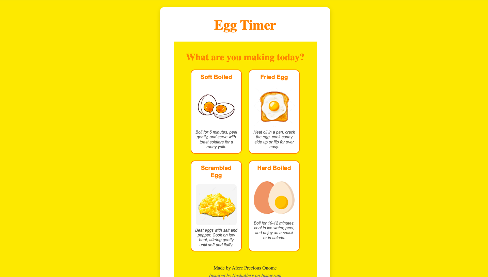

# 🥚 Egg Timer App

An intuitive and fun egg timer app that helps you perfectly cook different types of eggs , whether you like them soft-boiled, hard-boiled, scrambled, or fried.

Built with ❤️ by **Afere Precious Onome**. Inspired by **Nashallery on Instagram**.

---

## 🔗 Live Demo

[👉 View it Live](https://egg-timer-qmmz.vercel.app/)

---

## 📸 Screenshots



---

## ✨ Features

- ⏱ Simple timer for different egg types:
  - Soft-Boiled
  - Hard-Boiled
  - Scrambled
  - Fried
- Photo previews of each egg type
- Recipes displayed as tooltips
- Sound alert when timer finishes
- Clean and responsive design

---

## 🚀 Getting Started

### 1. Clone the repo

```js
git clone https://github.com/AferePreciousOnome/eggTimer.git
cd egg-timer-app
```

### 2.Install dependencies

```js
pnpm i
```

## 3. Run the app

```js
pnpm run dev
```

**The app will run locally at http://localhost:5173**

# Folder Structure

```js
/src
  /components
    EggTimer.js
    SelectionScreen.js
  /assets
    stopSound.wav
    /photos
      softBoiled.jpeg
      fried.jpeg
      scrambled.jpeg
      hardBoiled.jpeg
  /styles
    EggTimer.module.css
    SelectionScreen.module.css
index.css
App.js
```

### Built With

- React
- CSS Modules
- JavaScript
- HTML5 Audio API

# Acknowledgements

- Design inspiration from Nashallery
- Sound and image assets sourced under free use

# Contact

If you have questions, suggestions, or just want to say hi:
**Afere Precious Onome**
preciousafere@gmail.com
